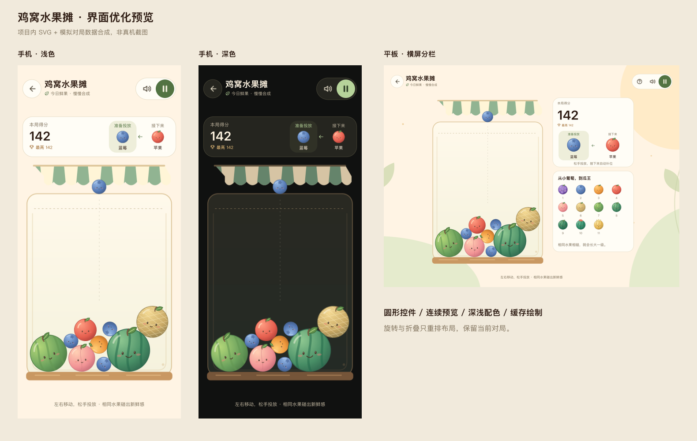

# 鸡窝水果摊：独立重构版

日期：2026-09-18

本次已完成独立新版实现和首页接入，入口保留「重构中」标记。应用与原生测试包可编译，纯逻辑用例已在主机执行；后续已在本地鸿蒙模拟器确认水果显示与合成计分，见 [SVG 加载修复](../../../测试报告/2026-09-18-水果摊SVG加载修复.md)。物理设备的折叠切换与音频仍待验收。

## 入口与保留范围

首页第一组同时展示两张「鸡窝水果摊」卡片：

| 入口 | 内部 ID | 实现 | 数据 |
| --- | --- | --- | --- |
| 重构中 | `suikaNext` | `entry/src/main/ets/gamesNext/fruitMarket/` | 独立对局存档与分数记录 |
| 经典版 | `suika` | 原 `entry/src/main/ets/games/suika/` | 原有数据和实现 |

旧游戏源码、旧游戏图片及音频没有修改或删除。新版不导入旧版游戏实现，也不使用旧版的手机画布限制。

## 玩法与交互

保留 11 级水果、相同水果碰撞合成、前六次投放顺序、后续 0–4 级随机水果、500 毫秒投放间隔和越线 3 秒结束。最终合成仍额外加 100 分，最高级水果不再继续合成。

新版重新实现物理：固定 60 Hz 模拟步长（每次回调最多补 2 步，接触列表在求解轮次间复用，碰撞收敛后提前结束，稳定水果逐颗休眠、受碰撞或失去支撑时局部唤醒）、按水果二维面积分配质量、碰撞冲量、多轮位置校正，以及独立的视觉滚动。窗口尺寸不参与物理计算，旋转、展开、收起仅调整画面排布，保留对局。

增加的体验：

- 点击落点直接投放，或左右拖动瞄准、松手投放；取消手势和窗口变化不会误投。
- 投放引导线、落点提示、当前与下一颗水果预览。
- 合成波纹、碎光、浮动得分和最高级水果反馈。
- 可见的警戒线、越线倒计时与短提示音；刚投放水果保留 700 毫秒判定宽限。
- 暂停、玩法图鉴、重新开局确认、返回大厅确认和结束结算。
- 每 5 秒自动保存；暂停、后台切换和退出时也保存，重新进入可继续。
- 存档失败会提示并保留重试机会，同时允许明确选择不保存返回。

物理步进采用游戏内部时间，暂停不累计越线时间；长时间后台恢复不会补算整段经过时间。

## 素材与主题

所有新版视觉素材放在 `entry/src/main/resources/rawfile/gamesNext/fruitMarket/`，当前共 133 个 SVG（含同一图标的明确主题配色版本）：

- `fruits/`：11 种水果，统一圆形碰撞轮廓、色彩、高光和表情。
- `scene/`：浅色与深色摊位、浅色与深色花园背景、游戏内水果摊标识。首页沿用经典版 `app/game_logos/game_icon_suika.svg`。
- `icons/`：返回、暂停、继续、重开、声音、静音、帮助、关闭、奖杯、叶片、箭头、展开和闪光。主题版本在 SVG 中明确指定描边颜色，不使用 `Image.fillColor` 给空心图标染色。

素材没有内嵌位图、字体、外部链接或脚本。水果源文件为 SVG，画布就绪时由 ImageBitmap 直接加载一次并复用。源图、Canvas、布局均使用默认 vp，按 360×520 世界坐标直接绘制，已移除在设备上产生密度与内容尺寸偏差的离屏位图缓存。加载中或失败时使用同等级的彩色数字水果兜底，不阻断投放和合成。光圈和粒子由 Canvas 绘制，不另用贴图。果堆停稳且效果结束后，Canvas 不再重复重画；投放、瞄准、主题、尺寸、倒计时或画布重建会触发刷新。

页面延续 App 的奶油底色、暖色文字与深色背景，原生按钮和弹窗随 App 主题切换。顶部使用圆形返回键、胶囊工具组和强调色暂停键；分数显示最高纪录，两个响应式组件展示“准备投放／接下来”的水果与名称。预览是状态展示，在摊位内投放后自动补位。游戏标题与入场提示不再展示“重构中”，首页仍保留入口区分标记。新版不强行沿用此前的鸡仔角色探索稿。

音效为本地合成的 7 个短 WAV：投放、普通合成、大水果合成、瓜王、越线警告、结算、按钮反馈。声音按钮与 App 设置联动；暂停、后台和退出会停止当前音效。未添加背景音乐。

全部资源可以通过以下脚本重新生成，不需要下载第三方素材：

```sh
python3 scripts/generate-fruit-market-assets.py
```

## 屏幕与窗口适配

- 新版打开期间请求自动旋转；退出时恢复进入之前的方向策略，不改变其他游戏的方向设置。
- 根据实际窗口尺寸布局，不经过 `CoopViewport.frame()`。
- 手机竖屏使用上方分数与水果预览、下方摊位。
- 平板、展开大屏和手机横屏使用摊位与侧栏；侧栏内容可滚动。
- 查询状态栏、导航指示区和挖孔区域，留出相应安全边距。
- 半折叠设备提供折痕信息时，使用较大的连续显示区域，避免把操作区跨在折痕上。空间过小时暂停并显示展开/放大窗口提示；空间足够的半折叠、普通手机和大屏仍沿用原布局。
- 展开与收起不重建物理世界；重排时取消进行中的触摸，防止位置变化导致误投。小区域恢复为大区域后，由用户点击继续，不自动恢复掉落或倒计时。

最小可玩区域阈值、手机不误拦截检查、保存与退出行为见 [水果摊折叠与小窗口](水果摊折叠与小窗口.md)。

布局逻辑已覆盖 320×568、390×844、844×390、768×1024、1024×768、1280×800、720×720 等 vp 窗口，以及横向和纵向折痕场景。这些是逻辑检查，不等同于相应硬件上的实测。

旋转策略实现参考[华为窗口旋转文档](https://developer.huawei.com/consumer/cn/doc/harmonyos-guides/window-rotation)，接口以项目当前 SDK 编译结果为准。

## 数据与成就

新版存档使用独立 preferences 库 `fruit_market_next_v1`，保存水果位置与速度、随机序列、分数、最佳成绩、投放序号、越线时间和会话标识。v4 增加可选的休眠水果 ID 列表，旧 v1 存档仍可读取，恢复时重新校验支撑与边界。写入串行执行，避免较早的自动保存覆盖新状态。

App 的新版结算记录使用 `suikaNext`，不覆盖经典版分数。新版成就事件归属逻辑游戏 `suika`，接入「瓜摊开张」「西瓜到手」「瓜王诞生」及通用完成局数；收藏新旧两个版本只算同一款游戏。

## 代码分工

| 文件 | 职责 |
| --- | --- |
| `FruitMarketPage.ets` | 页面、输入、生命周期、暂停、存档与成就上报 |
| `MarketModel.ets` | 水果、常量、会话与合成数据 |
| `MarketEngine.ets` | 固定步长物理、投放、合成、越线判定、存档校验 |
| `MarketLayout.ets` | 窗口尺寸、安全区、折痕布局与最小可玩区域判断 |
| `MarketSpacePrompt.ets` | 小区域引导、浅深色展开图标与可滚动的退出入口 |
| `MarketWindow.ets` | 系统方向策略、窗口与折叠事件 |
| `MarketRenderer.ets` | SVG 加载与直接绘制、可玩兜底、Canvas 水果与合成效果 |
| `MarketFrameClock.ets` | 屏幕刷新调度、暂停回收与不支持设备的计时回退 |
| `MarketPerformance.ets` | 每 5 秒汇总与限频停顿明细，区分物理、重画、休眠和存档提交 |
| `MarketControls.ets` / `MarketPanels.ets` | 原生按钮、统计、图鉴与弹窗 |
| `MarketPalette.ets` | 与 App 衔接的浅深色配色 |
| `MarketAudio.ets` / `MarketStorage.ets` | 独立音效资源生命周期与存档 |

## 预览与验收

下面是用项目 SVG、布局计算和模拟对局数据合成的视觉预览，**不是鸿蒙真机截图**。原生字体布局、触摸与 SVG 解码表现仍需在设备确认。



本轮控件、预览刷新和性能优化见 [UI 与性能测试报告](../../../测试报告/2026-09-18-水果摊UI与性能优化.md)。按用户要求未启动模拟器，因此下图为设计合成预览，本轮原生显示仍待验证。


初版验证与待验项目见 [测试报告](../../../测试报告/2026-09-18-水果摊独立重构版.md)。

## 尺寸与性能日志跟进

PX-v2 的离屏密度偏差已改为原始 SVG 直接绘制。用户随后提供的 v3 原生日志表明：少量水果时改善明显，但 31 颗活动水果仍降到约 18 次回调/秒，35 颗唤醒时活动物理平均约 69ms，全部休眠时也在重复重画。v4 针对这些场景增加局部休眠、接触配对复用与静止画面按需重画。34 组主机检查及应用/原生测试包编译通过，包含真实 35 果几何回放。用户随后提供的 v4 满筐设备日志中，38–41 颗水果维持约 58–60 次回调/秒；约 50 秒内记录到的 3045 个间隔中，10 个超过 33.4ms，用户反馈明显更流畅。局部休眠与按需绘制已生效，暂保留 v4 为当前性能基线；仍有一次 43.887ms 的物理区间峰值，且回调频率不等同 GPU 呈现帧率。完整样本、判断和后续日志筛选方法见 [水果摊性能日志](水果摊性能日志.md)。
