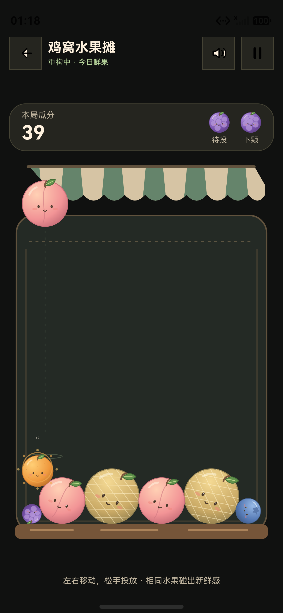

# 水果摊 SVG 加载阻断修复

日期：2026-09-18

## 问题与原因

用户打开新版后始终看到「水果还没摆好」，重新加载也无法进入游戏。

连接到本地鸿蒙模拟器 `127.0.0.1:5555` 后，读取到重复错误：

```text
Fruit Market SVG decode failed: Decode failed. e.g.,Decode image header failed.
```

原实现把 11 个 SVG 全部通过 ImageKit `createImageSource` / `createPixelMap` 解码成功作为游戏启动条件。该解码路径在当前模拟器失败，导致整局被错误弹窗阻断。失败日志不能单独证明具体是哪个 SVG 属性不兼容，因而不将其归结为所有设备都不支持 SVG。

## 修复

- Canvas 改为用 `ImageBitmap(resource://RAWFILE/...)` 直接加载 SVG，在画布就绪后准备资源。
- 所有新版 SVG 补齐与 viewBox 一致的显式 width、height，保持源素材为矢量。
- 游戏启动只等待对局恢复，不再等待水果图片解码，不会因任何一个 SVG 失败关闭整局入口。
- 图片未就绪、构造失败或绘制抛错时，绘制同等级、同碰撞半径的彩色数字水果。投放、合成、计分照常运行；延迟就绪的 SVG 自动替换临时图形。
- 绘制失败的图片停止重试并释放，退出游戏释放其余 ImageBitmap。

Canvas 的 SVG 支持依据 [OpenHarmony ImageBitmap 官方接口文档](https://github.com/openharmony/docs/blob/master/zh-cn/application-dev/reference/apis-arkui/arkui-ts/ts-components-canvas-imagebitmap.md)。

## 验证

- 默认应用构建通过。
- 覆盖安装至上述本地模拟器成功，未卸载或清理 App 数据。
- 实际页面不再显示素材错误弹窗；截图中水果使用完整 SVG 美术，存在合成加分效果，本局显示 39 分。
- 界面读取先看到 7 分，稍后的截图显示 39 分。用户也在同时试玩，不将这些分数变化全部归因于自动化点击。
- 新增渲染回归 4 组：正常加载与释放、全部素材失败仍能投放合成、延迟就绪恢复、绘制异常与句柄释放。均通过。
- 原有新版规则与布局的 9 组用例继续通过。

```sh
node scripts/test-fruit-market-renderer.mjs
node scripts/test-fruit-market-next.mjs
```

此处验证的是模拟器实际运行，并不替代物理折叠屏、平板及扬声器效果的设备验收。


