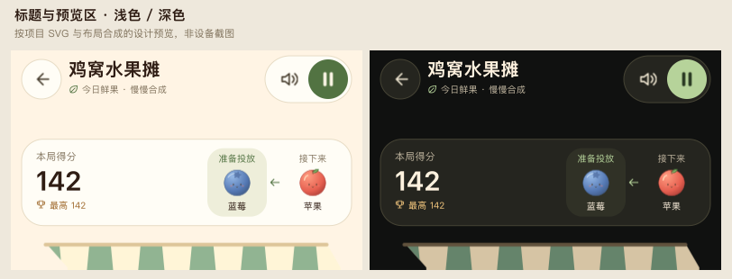

# 水果摊 UI 与性能优化

日期：2026-09-18。范围仅独立新版及首页图标映射，旧游戏代码与素材保持原样。按用户要求不启动模拟器；本轮没有安装或原生 UI 实测。

## 界面与预览

- 主题图标改为明确的 SVG 描边配色，去掉 `fillColor`，避免深色模式下黑描边与白色填充混杂。主按钮深色模式使用浅鼠尾草绿底与深绿图标/文字；浅色模式使用深绿底与奶油色文字。
- 顶部采用圆形返回键、胶囊工具组、独立强调的暂停键；圆角明确写入边框参数，标题与副标题重新分层。
- 游戏内标题及入场提示去除“重构中”。首页继续区分新旧入口，新版入口复用经典版水果摊图标。
- 分数卡显示本局得分与最高纪录；“待投／下颗”改为带名称的“准备投放／接下来”。它们是队列预览，实际操作仍在摊位内进行。
- 原预览通过按值传参的 `@Builder Preview(label, level)` 建立 UI，存在初始参数捕获问题。改为独立的 `MarketFruitPreview` 响应式组件。编译产物中的子组件更新分支已确认直接绑定 `this.current` / `this.next`；显示结果仍需原生设备验收。
- 逻辑测试覆盖 16 次连续投放、被冷却拒绝的投放、存档恢复：实际投放等级等于当前预览，下一颗补到当前，拒绝投放不推进队列。
- 窄屏预留 96 vp 统计卡和 12 vp 间距；宽屏水果预览按侧栏剩余宽度分配，适配最小 190 vp 侧栏。

设计图由项目 SVG、布局参数与模拟对局数据合成，非设备截图：

## 性能变更

1. 碰撞宽阶段复用排序数组、删除集合与合成队列；对近乎有序的列表做插入排序，每轮校正都重新排序，合成、投放或恢复存档后刷新列表。保持 120 Hz 物理步长、6 轮校正、合成分数与碰撞参数。
2. `DisplaySync` 跟随屏幕刷新，期望 60 帧；拖动不再额外逐事件重绘。暂停/离开销毁回调，不支持时回退单个计时器；代次标识阻止旧回调推进新一轮游戏。
3. SVG 仍为唯一水果源素材。每种水果按实际物理像素尺寸生成共享缓存，同一帧最多生成一个等级，每张最大 768×768。尺寸变化释放旧缓存，退出释放全部缓存；离屏失败、透明结果或无效缓存回退 SVG，再失败才使用可玩数字水果。
4. 无合成时不重复分配空事件数组和效果过滤数组。

主机 CPU 基准（同一进程、24/64/120 颗小水果，锁定合成以保持相同负载；每个样本连续推进 600 帧，每组 5 次取中位数）：

| 水果数 | 修改前每帧计算 | 修改后每帧计算 | 耗时下降 |
| --- | --- | --- | --- |
| 24 | 0.0165 ms | 0.0081 ms | 50.7% |
| 64 | 0.0776 ms | 0.0345 ms | 55.6% |
| 120 | 0.1949 ms | 0.0842 ms | 56.8% |

这些数字只代表本机 Node 执行的物理计算，不能换算为鸿蒙设备帧率或总功耗。原生 SVG 缓存收益、内存与帧稳定性待设备测量。脚本每次确认游戏未结束、身体数量未变、坐标有限且在边界内，避免测到空转。

重跑当前基准：`node scripts/bench-fruit-market-next.mjs`；传入修改前 `MarketEngine.ets` 文件路径可在同一进程比较。

## 验证

- `scripts/test-fruit-market-next.mjs`：11 组纯逻辑测试通过，含预览队列、恢复后的碰撞列表、固定步长和手机/横屏/平板/折痕布局。
- `scripts/test-fruit-market-renderer.mjs`：9 组通过，含延迟/失败 SVG、缓存复用、每帧生成预算、密度变化、透明/空/异常缓存、缓存绘制失败回退与释放一次。
- `scripts/test-fruit-market-clock.mjs`：3 组通过，含重复启动、暂停恢复、旧回调抑制、原生创建/启动失败后的计时回退。
- `scripts/test-suika-rules.mjs`：通过。
- 124 个 SVG XML 解析、显式宽高及主题图标透明填充检查通过。
- 应用构建、原生测试包构建均通过；无设备执行。
- `git diff --check` 通过；旧游戏目录相对 HEAD 无差异。

仍待设备确认：连续投放时预览实际刷新、两种主题下原生圆角/文字布局、暂停恢复的实际帧回调、折叠与旋转时的缓存重建、大量水果的渲染帧率。未重新启动用户已关闭的模拟器。
